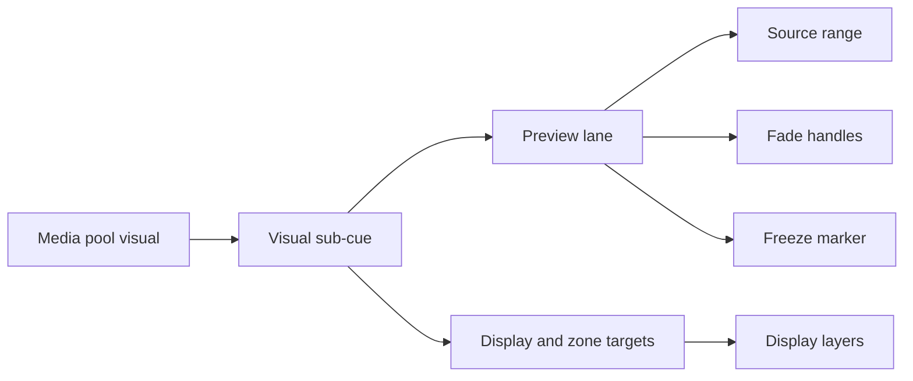

# Stream Workspace

Stream is the show-programming workspace. Use it when a show needs scenes, triggers, audio sub-cues, visual sub-cues, control automation, manual boundaries, loops, or parallel playback branches.

Unlike Patch, which is best for standalone static routed playback, Stream is built for authored show flow. It can run scene chains as independent threads so manual starts, side timelines, loops, and parallel branches do not have to collapse into one fragile linear timeline.

## When To Use It

Use Stream when you need to:

- Build a multi-scene show.
- Run manual scenes alongside automated follow scenes.
- Trigger scenes from follow-start, follow-end, delay, or timecode behavior.
- Route audio and visuals as part of scene playback.
- Automate global audio mute, display blackout, scene transport, or audio sub-cue values.
- Review complex timing in Flow or Gantt views.

## Header

The Stream header is the live control area for scene playback. It includes Stream transport, a timecode rail, rate control, live state information, and selected scene title or note editing.

Stream transport is separate from Patch transport. Patch playback is for direct routed playback. Stream playback runs the programmed scene graph and projects audio, visual, and control sub-cues onto the show outputs.

## List Mode

List mode is for ordered editing and quick review. Use it to scan scene order, select scenes, check state, and find validation issues. Dropping an audio or visual pool item onto a scene row creates the matching sub-cue, selects it for editing, and expands the scene so the new cue is visible immediately.

List mode is usually the fastest place to build the backbone of a show before arranging relationships visually.

## Flow Mode

Flow mode is for spatial scene authoring. Scene cards show structure, state, and relationships. Use Flow when you need to see how scenes connect, arrange branches, add followers, or keep manual scenes and disabled scenes visually clear.

Flow supports card layout work such as drag, resize, fit, reset, and context actions. Recent Stream behavior keeps dragged card positions steadier while runtime state changes, so authoring remains usable during playback and review.

## Gantt Mode

Gantt mode is for timing review. It shows how scene threads and timeline instances line up over time. Use it to inspect main timelines, parallel timelines, side timelines, manual loops, and active cue spans.

Gantt mode supports zoom and fit behavior. Non-main timelines can be reviewed and removed from the view when they are no longer useful. Audio and visual output details can also show Gantt-style cue rows so you can inspect what each output is doing while Stream is running.

## Bottom Tabs

The bottom area exposes three working tabs:

- **Scene**: Edit the selected scene and its sub-cues.
- **Mixer**: Review Stream-projected audio behavior against virtual outputs.
- **Displays**: Review Stream-projected display behavior and display details.

## Scene Edit Panel

The scene edit panel is where you adjust scene title, note, enabled state, trigger behavior, preload lead time, loop policy, and sub-cues.

The sub-cue rail lists audio, visual, and control sub-cues. Use it to select, add, duplicate, remove, and inspect cues. Scenes and sub-cues with validation errors are highlighted in the workspace so you can find problems without reading logs line by line.

Audio sub-cues use a waveform-centered editor for trims, auditioning, fades, pitch, and automation. Visual sub-cues use a preview-centered lane for playback review, source range trimming, fades, and freeze markers.

## Validation And Readiness

Stream validation appears in the global footer, scene list state, Flow cards, scene pills, and sub-cue rows. Messages use user-facing labels such as scene titles and sub-cue positions instead of internal ids.

A Stream issue can block playback, degrade readiness, or simply warn that something will not behave as expected. Fix missing media, missing outputs, missing display targets, invalid fade timing, invalid freeze points, and missing duration values before relying on a show live.

## Related Pages

- [Build Stream scenes](../tasks/build-stream-scenes.md)
- [Program scene triggers](../tasks/program-scene-triggers.md)
- [Edit audio sub-cues](../tasks/edit-audio-sub-cues.md)
- [Edit visual sub-cues](../tasks/edit-visual-sub-cues.md)
- [Use control sub-cues](../tasks/use-control-sub-cues.md)
- [Stream model](../reference/stream-model.md)
